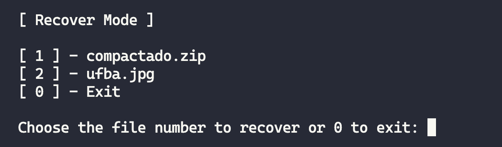

# MATA59 Trabalho Final - Projeto cliente-servidor

Aplicação cliente-servidor em Python, utilizando a biblioteca de sockets, para realizar operações de depósito e recuperação de arquivos no modo cliente-servidor via TCP. Este projeto é 100% implementado em Python.

## Requisitos

- Possuir instalado o Python
- Possuir instalado o gerenciador de pacotes pip
- Clonar o repositório para a execução do projeto

## Funcionalidades

Modos de funcionamento da aplicação:
  - Depósito:
    - O cliente envia um arquivo para o servidor, juntamente com o nível de tolerância a falhas requerido, especificando se será uma, duas ou três réplicas do arquivo
    - O servidor recebe o arquivo e o armazena em diretórios específicos, considerando o nível de tolerância especificado.
  - Recuperação:
    - O cliente informa o nome do arquivo que deverá ser recuperado.
    - O servidor encontrará o arquivo de alguns dos diretórios replicados e devolverá ao cliente.

A aplicação é também mantém a consistência das réplicas, ou seja, se o cliente muda o nível de tolerância a falhas para um certo arquivo, o sistema aumenta ou diminui a quantidade de réplicas conforme a última solicitação.

## Utilização

Para executar o projeto, é necessário executar o servidor e o cliente em terminais diferentes. Para isso, abra dois terminais e execute os seguintes comandos:

- Terminal 1:
  - `python3 main-server.py`
- Terminal 2:
  - `python3 main-client.py`

> Obs: Uma janela interativa no terminal do cliente será aberta para que o usuário possa interagir com o sistema, depositando e recuperando arquivos.

No menu principal basta escolher o tipo de operação que deseja fazer, digitando o número correspondente e pressionando `Enter`.

---

No modo de depósito, será listado todos os arquivos que estão na pasta `local`, onde o usuário deve informar qual arquivo deseja depositar no servidor, digitando o número correspondente e pressionando `Enter`. Após isso, o usuário deve informar o nível de tolerância a falhas que deseja para o arquivo, digitando o número correspondente e pressionando `Enter`.

| Replicação  | Descrição                                | Pasta de armazenamento                                        |
| ----------- | ---------------------------------------- | ------------------------------------------------------------- |
| Single-AZ   | Será salva apenas 1 réplica do arquivo   | `cloud/us-east1-a`                                            |
| Dual-AZ     | Serão salvas 2 réplicas do arquivo       | `cloud/us-east1-a` e `cloud/us-east1-b`                       |
| Triple-AZ   | Serão salvas 3 réplicas do arquivo       | `cloud/us-east1-a`, `cloud/us-east1-b` e `cloud/us-east1-c`   |

---

No modo de recuperação, será listado todos os arquivos que estão na pasta `cloud/us-east1-a`, onde o usuário deve informar qual arquivo deseja recuperar do servidor, digitando o número correspondente e pressionando `Enter`.

## Arquitetura do projeto

